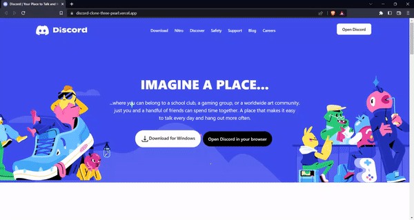

<div align="center">

<h4>The Dicord Home Page</h4>
<br>

[](https://html.com/ "HTML")

[](https://code.visualstudio.com/ "Visual Studio Code")

<h3>The Discord Home Page: Design and Build a Responsive Website</h3>
</div>

---

<br>

## About

Our Frontend Website is designed to give beautiful UI , with featuers such as our Nav section, main section and Attractive UI.Build with HTML and Tailwind, Our Website is Userfriendly and Responsive in all device.

## Output



### Live at

https://discord-clone-three-pearl.vercel.app/
## Technology Stack

- HTML And Tailwind

## To Run the Project

```sh
$ git clone https://github.com/Raviraj39/Discord-clone
$ cd Discord-clone
$ run the live server
Runs the app in the development mode.\
Open [http://localhost:5000](http://localhost:5000) to view it in the browser.
```

## Learn More

You can learn more in the https://tailwindcss.com/.

To learn React, check out the [Tailwind documentation](https://tailwindcss.com/docs).

### Show some :heart: and star the repo to support the project